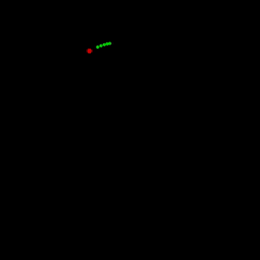

# liquidML
Machine learning server for interaction design. LSTM by torch has been implemented as an example. back_server.py will response predicted parameters to POST requests. A POST request can be either of a teacher data or prediction requests.

# Overview


# Requirement
```
python >= 3.5.3
torch (0.2.0.post3)
urllib3 (1.22)
numpy (1.13.3)
```

# Quick run
```
python back_server.py
run front_sample/front_sample.pde
```

# Protocol (For current LSTM implementation)
A naive protocol between front and back has been set (pull requests welcomed).

```HTTP POST from client
x_t1,y_t1:x_t2,y_t2
```

means "Learn a model that predict (x_t2, y_t2) from (x_t1, y_t1)". For example:

```
0.23,0.54:0.12,0.54
```

The server stores teacher data to 'teacher.txt'. 'brain.py' start training when the teacher data reaches to enough data size.

The server is multithreaded so to response predictions while training the model.

# Result
Screen capture of Processing. Predicting 5 steps (green) ahead of rotating point (red). 1000 teacher data were fed to LSTM Cell with 100 layers trained with 10 iterations.


